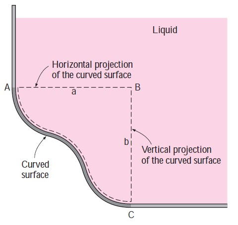
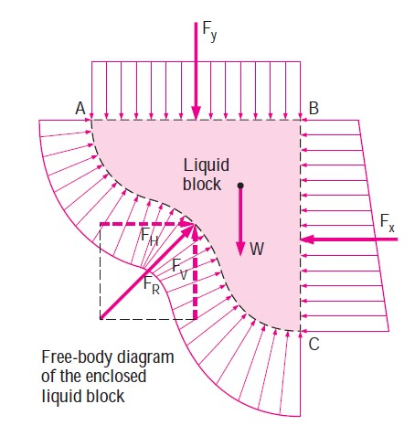
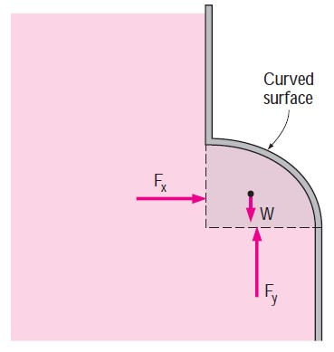

```{r setup, include=FALSE}
library(knitr)
```

## Objetivos:

Ao final deste tópico, o aluno deverá ser capaz de estimar a força resultante exercida pela água, e determinar sua linha de ação, em estruturas com superfícies curvas submersas empregando o diagrama de corpo livre para:

- Calcular as componentes horizontal e vertical da força hidrostática resultante
- Determinar a linha de ação da força resultante


## Leitura

Os alunos deverão ler pelo menos um dos textos sugeridos na bibliografia do curso.

## Figuras para aula


```{r curva-geral,echo=FALSE, fig.align = 'center', out.width = "50%", fig.cap = "Fonte: Çengel & Cimbala (2015). Mecânica dos Fluidos."}

```

```{r curva-geral_2,echo=FALSE, fig.align = 'center', out.width = "50%", fig.cap = "Fonte: Çengel & Cimbala (2015). Mecânica dos Fluidos."}

```


```{r curva-geral_3,echo=FALSE, fig.align = 'center', out.width = "50%", fig.cap = "Fonte: Çengel & Cimbala (2015). Mecânica dos Fluidos."}

```
