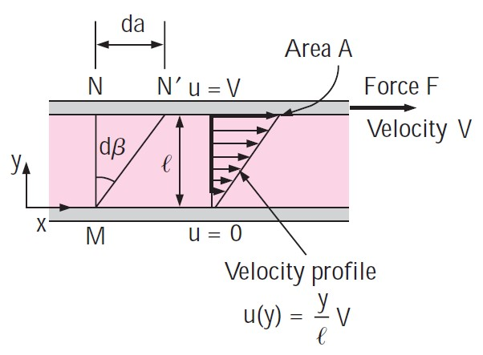
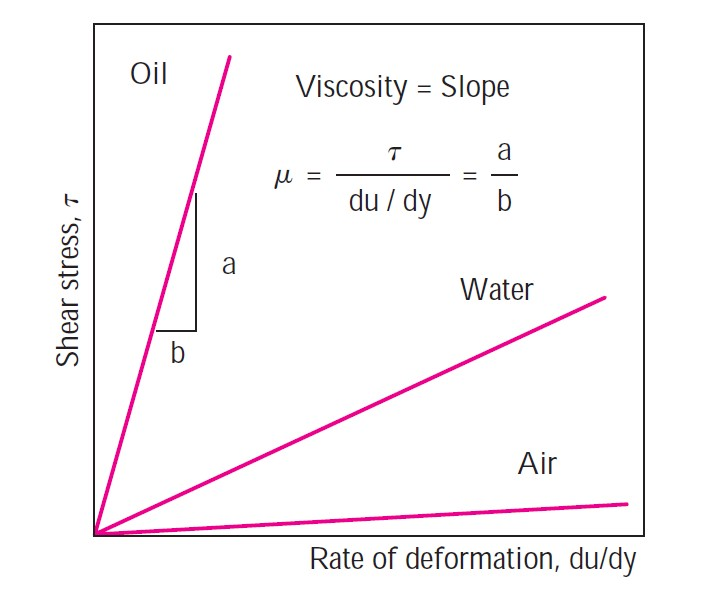
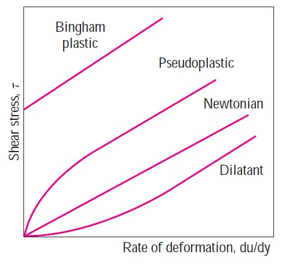

```{r setup, include=FALSE}
library(knitr)
```

## Objetivos:

Ao final deste tópico, o aluno deverá ser capaz de:

- Entender as diferenças entre gases, líquidos e sólidos;
- Saber explicar as propriedades de um fluido, tais como massa específica, peso específico, densidade relativa, viscosidade dinâmica, tensão superficial, e tensão de vapor;
- Aplicar os conceitos de viscosidade e tensão superficial em situações práticas na engenharia;
- Identificar problemas práticos nas áreas de engenharia civil e ambiental relacionados com fluidos.

## Leitura

Os alunos deverão ler pelo menos um dos textos elencados na seção Bibligrafia Sugerida na página inicial deste site. 

Em seguida, procure entender o que difere um sólido de um fluido. Reflita sobre essas diferenças. Quais são as principias características que levam um sólido a se comportar de maneira diferente de um fluido? E por que líquidos e gases, ambos fluidos, se comportam também de maneira diferente? 

Por último, leia sobre as diversas propriedades de um fluido, focando principalmente, mas não apenas, na viscosidade, tensão superficial, e tensão de vapor. 

## Assuntos a serem tratados em aula

### Principais diferenças entre fluido e sólido

### Propriedades relacionadas com massa e volume

- massa específica ($\rho$)
- peso específico ($\gamma$)
- densidade relativa ou gravidade específica

### Viscosidade

#### Relação entre gradiente de velocidades e taxa de deformação de um fluido

A Figura abaixo apresenta uma situação em que um fluido está entre duas placas, uma na parte infeiror, que se mantém imóvel, e outra na parte superior, que sofre a ação de uma força e se movimento com velocidade $V$. 

Devido à condição de não-escorregamento do fluido, as partículas do fluido em contato com a placa possuem velocidade zero relativa à placa. Isso significa que as partículas em contato com a placa inferior ficarão imóveis, enquanto as partículas de fluido localizadas junto à placa superior se movimentarão com velocidade $V$. 

```{r viscosidade,echo=FALSE, fig.align = 'center', out.width = "50%", fig.cap = "Fonte: Çengel & Cimbala (2015). Mecânica dos Fluidos."}

```

A condição de não-escorregamento do fluido resulta numa situação em que a velocidade das partículas fluidas na direção $x$, denominada aqui de $u$, varia na direção vertical, formando um perfil de velocidades, como mostrado no Figura. Assumindo que esse perfil de velocidades é linear, podemos dizer então que,


$$u(y) = a*y+b$$

em que $a$ e $b$ são parâmetros da equação que podem ser estimados. A estimativa de $a$ e $b$ é feita considerando as condições de contorno do problema, quais sejam, $u(y=0)=0$ e $u(y=l)=V$, o que resulta em $a=V/l$ e $b=0$, de forma que,

$$u(y) = \frac{V}{l}*y$$ 
Antes da força $F$ ser aplicada à placa superior, podemos imaginar um conjunto de partículas fluidas alinhadas na vertical (ver Figura) junto ao ponto $M$. Durante um intervalo de tempo infinitesimal $dt$ a partir do momento de ínício da aplicação da força $F$, a placa superior, assim como as partíclas fluidas locaçizdas junto à ela, se deslocarão uma distância $\da = V*dt$. Devido ao perfil de velocidades, observamos uma deformação do fluido, que pode ser representada pela variável $d\beta$, como mostrado na Figura. 

A tangente do ângulo $d\beta$ é dada por,

$$tan(d\beta)=\frac{da}{l}=\frac{V*dt}{l}$$
Sabemos que para ângulos pequenos, $tan(\theta)\approx \theta$, de forma que

$$\frac{d\beta}{dt}=\frac{V}{l}$$
em que $d\beta/dt$ é a taxa de deformação do fluido. Vale notar que $V/l$ é também o gradiente de velocaidades na direção $y$,

$$
\frac{du(y)}{dy} = \frac{V}{l}
$$
de forma que a taxa de deformação de fluido ao longo do tempo é igual ao gradiente de velocidade na direção perpendicular ao escoamento,

$$
\frac{d\beta}{dt}=\frac{du(y)}{dy}
$$

#### Relação entre a tensão de cisalhamento e a taxa de deformação do fluido

Estudos em laboratório mostraram que alguns fluidos apresentam um comportamento tal que a tensão de cisalhamento é proporcional à taxa de deformação do fluido,

$$
\tau \propto \frac{du}{dy}
$$
Fluidos que possuem esse comportamento são camados de fluidos newtonianos, e a constante de proporcionalidade nesses casos é chaam de viscosidade dinâmica, $\mu$, de forma que 

$$
\tau = \mu \frac{du}{dy}
$$
A Figura abaixo apesenta a relação entre a tensão de cisalhamento e a taxa de deformação do fluido para o ar, água, e petróleo. Pode-se notar que para se obter um dado valor fixo de taxa de deformação, a tensão de cisalhamneto necessária para deformar o petróleo é muito mais elevada do que para água e ar, o que indica que a viscidade diNãmica do petróleo é mais elevada do que as da água e do ar. 

```{r tensao_vs_deformacao,echo=FALSE, fig.align = 'center', out.width = "50%", fig.cap = "Fonte: Çengel & Cimbala (2015). Mecânica dos Fluidos."}

```


#### Fluidos newtonianos e não-newtoniano

```{r newtoniano,echo=FALSE, fig.align = 'center', out.width = "50%", fig.cap = "Fonte: Çengel & Cimbala (2015). Mecânica dos Fluidos."}

```


#### Viscosímetro
### Coesão, adesão e tensão superficial

### Capilaridade

## Vídeo-aula sobre viscosidade

[Este vídeo curto](https://web.microsoftstream.com/video/e8ae3e86-dead-44e8-9bf0-2e79f8874301) apresenta a relação entre a viscosidade de um fluido e sua taxa de deformação.

